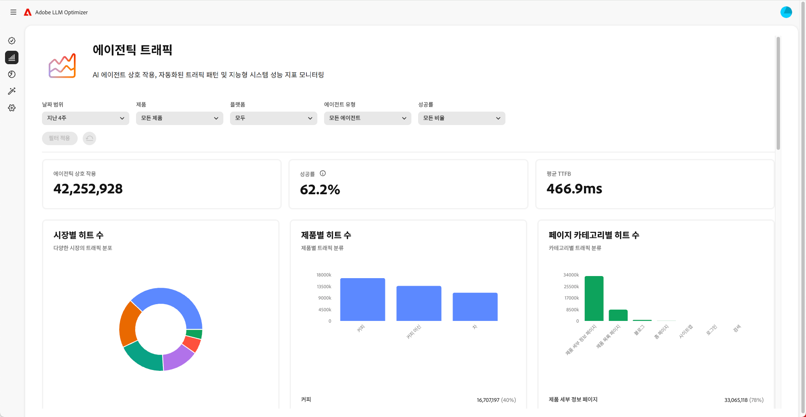
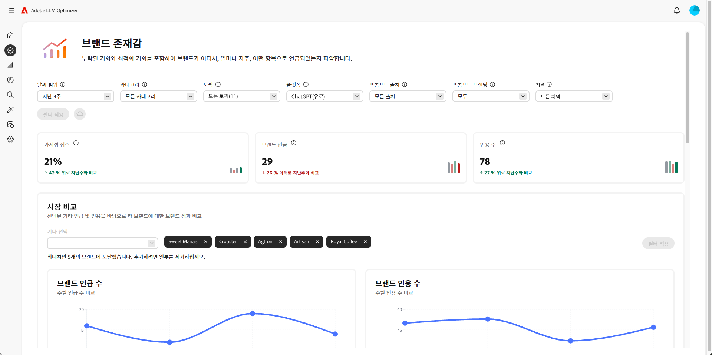
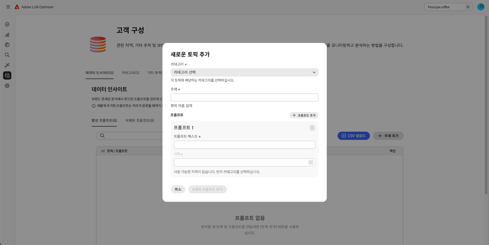
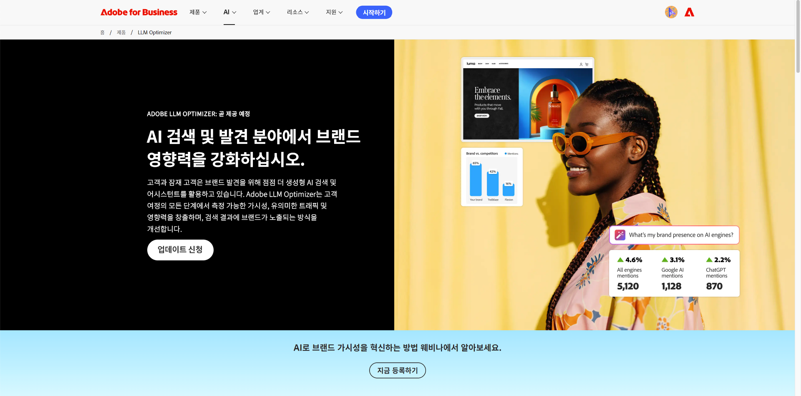

# Adobe LLM Optimizer

<!-- VIDEO HERE/SLIDES HERE -->

Adobe LLM Optimizer은 생성 엔진 최적화를 위한 생성 AI 우선 애플리케이션으로, 브랜드가 AI 기반 검색 환경에서 가시성, 정확성 및 영향력을 향상시킬 수 있도록 설계되었습니다. AI가 생성한 답변의 브랜드 유무에 대한 통찰력을 제공하고, 규범적인 콘텐츠 권장 사항을 제공하고 최적화 수정 사항을 자동화합니다.

## LLM Optimizer 시작

<!-- CARDS

* ./overview/quick-start.md
  {title= Quickstart guide}
  {description= Learn how to quickly get up and running with the LLM Optimizer.}
  {image= ./assets/overview/agentic-traffic-card.png}
  {target=_blank}
  {cta=Learn more}
* ./dashboards/dashboards-overview.md
  {title= Dashboards overview}
  {image= ./assets/overview/brand-presence-card.png}
  {description= Learn how to get insights and get recommendations for your site with dashboards.}
  {target=_blank}
  {cta=Learn more}
-->
<!-- START CARDS HTML - DO NOT MODIFY BY HAND -->

    

        

            

                <figure class="image x-is-16by9">
                    
                </figure>
            

            

                

                    

                        <a href="./overview/quick-start.md" target="_blank" rel="referrer" title="빠른 시작 안내서">빠른 시작 안내서</a>
                    

                    
LLM Optimizer을 빠르게 시작하고 실행하는 방법에 대해 알아봅니다.

                

                <a href="./overview/quick-start.md" target="_blank" rel="referrer" class="spectrum-Button spectrum-Button--outline spectrum-Button--primary spectrum-Button--sizeM" style="align-self: flex-start; margin-top: 1rem;">
                    자세히 알아보기
                </a>
            

        

    

    

        

            

                <figure class="image x-is-16by9">
                    
                </figure>
            

            

                

                    

                        <a href="./dashboards/dashboards-overview.md" target="_blank" rel="referrer" title="대시보드 개요">대시보드 개요</a>
                    

                    
대시보드를 사용하여 통찰력을 얻고 사이트에 대한 권장 사항을 얻는 방법에 대해 알아봅니다.

                

                <a href="./dashboards/dashboards-overview.md" target="_blank" rel="referrer" class="spectrum-Button spectrum-Button--outline spectrum-Button--primary spectrum-Button--sizeM" style="align-self: flex-start; margin-top: 1rem;">
                    자세히 알아보기
                </a>
            

        

    

<!-- END CARDS HTML - DO NOT MODIFY BY HAND -->

## LLM Optimizer에 대해 자세히 알아보기

<!-- Add cards -->

<!-- CARDS

* ./tutorials/best-practices.md
  {title= Best practices for marketers and SEO analysts}
  {image= ./assets/overview/best-practices-card.png}
  {description= Learn how LLM Optimizer can help you drive brand authority in AI search and discovery.}
* https://business.adobe.com/products/llm-optimizer.html
  {title = Explore the capabilities of the Adobe LLM Optimizer}
  {image = ./assets/overview/business-adobe.png}
  {target=_blank}
  {cta=Learn more}

-->
<!-- START CARDS HTML - DO NOT MODIFY BY HAND -->

    

        

            

                <figure class="image x-is-16by9">
                    
                </figure>
            

            

                

                    

                        <a href="./tutorials/best-practices.md" target="_blank" rel="referrer" title="마케터 및 SEO 분석가를 위한 우수 사례">마케터 및 SEO 분석가를 위한 우수 사례</a>
                    

                    
LLM Optimizer이 AI 검색 및 검색에서 브랜드 권위를 높이는 데 어떻게 도움이 되는지 알아봅니다.

                

                <a href="./tutorials/best-practices.md" target="_blank" rel="referrer" class="spectrum-Button spectrum-Button--outline spectrum-Button--primary spectrum-Button--sizeM" style="align-self: flex-start; margin-top: 1rem;">
                    자세히 알아보기
                </a>
            

        

    

    

        

            

                <figure class="image x-is-16by9">
                    
                </figure>
            

            

                

                    

                        <a href="https://business.adobe.com/products/llm-optimizer.html" target="_blank" rel="referrer" title="Adobe LLM Optimizer의 기능 탐색">Adobe LLM Optimizer의 기능 살펴보기</a>
                    

                    
Adobe LLM Optimizer을 사용하여 AI 기반 검색의 가시성을 높입니다. 생성 검색 및 LLM(Large Language Model) 검색을 위해 콘텐츠를 최적화하여 결과를 도출합니다.

                

                <a href="https://business.adobe.com/products/llm-optimizer.html" target="_blank" rel="referrer" class="spectrum-Button spectrum-Button--outline spectrum-Button--primary spectrum-Button--sizeM" style="align-self: flex-start; margin-top: 1rem;">
                    자세히 알아보기
                </a>
            

        

    

<!-- END CARDS HTML - DO NOT MODIFY BY HAND -->

## 참조

참조 링크는 여기로 이동해야 합니다.
